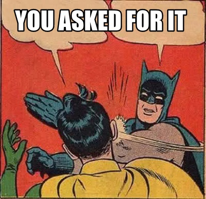

## [BubbleTea]("https://github.com/charmbracelet/bubbletea")

Popular and quite functional tui framework. BUT - remember, you are writing a UI....

### Basics

It's uses a `Model` - `View` - `Update` pattern ala `Elm` or `Redux`.

* Model - State of the application
* View - How to render the state
* Update - Handle events that happen in your app

In BubbleTea, that translates to the interface:


```golang
// Model contains the program's state as well as its core functions.
type Model interface {
	// Init is the first function that will be called. It returns an optional
	// initial command. To not perform an initial command return nil.
	Init() Cmd

	// Update is called when a message is received. Use it to inspect messages
	// and, in response, update the model and/or send a command.
	Update(Msg) (Model, Cmd)

	// View renders the program's UI, which is just a string. The view is
	// rendered after every Update.
	View() string
}
```