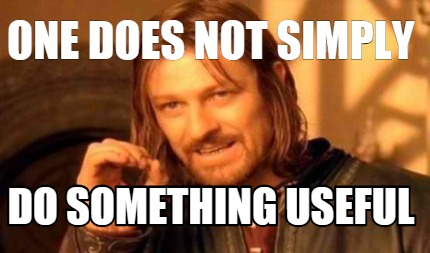

## Doing Something Useful

This whole `Elm`y thing is based on handling "events" that "update" you model, which then trigger a re-render. So, how do you do events?

__BubbleTea Commands__:

```golang
type Msg interface{}

type Cmd func() Msg
```

Long story short: you run a function that returns anything. Helpful!

You will remember from our interface definition of the `Model` that both the `Init` and `Update` functions returned an optional `Cmd` - this is to allow you to trigger async actions that you want to affect your model and thus your view. If you have a bunch of things you want to do use `tea.Batch(...tea.Cmd)` which will just iterate over all the commands and run them.

## Grand Central Station

Your `Update()` function will get all these messages, and since they are all `interface{}` types, how do you handle them? Use a custom type for your message that you return from the `Cmd` so you can pase it based on it's `type` 