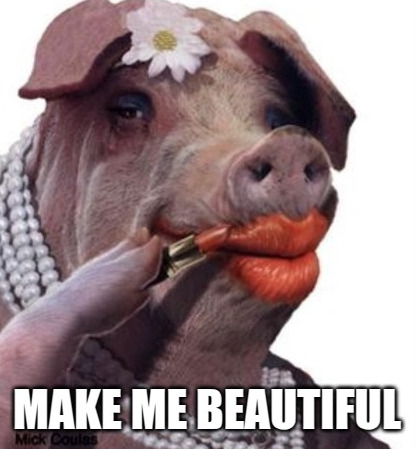

## [Lipgloss]("https://github.com/charmbracelet/lipgloss")

Our model only returns a string, so how do we do all the fancy display stuff? We could hardcode it:

```golang
return fmt.Sprintf("\033[32m--------\n|\033[97m this is the first row \033[32m|\n-------------\n")
```

and that would be horrible.

Enter `Lipgloss` a set of style convenience functions that can be used to generate strings that will have a formatted output on the terminal.

This is where you really get to start building your UI. It is `CSS`ish, and you can do all sorts of things like:

* Setting a Box or Window size and give it borders, padding, etc.
* Set Foreground and Background Colors
* Set text styles (bold, Underline, italic, etc)
* handle alignment

__BUT__ remember - you have to handle the ui layout and styling just like you would with, e.g. HTML, but rather than using markdown you get to do a lot of string building...

__ALSO__ remember - ELM is functional, so there is a tension between more idomatic `go` patterns and using the BubbleTea / Lipgloss stuff. They mostly revolve around pointer receivers for the models. Specifically when you are modifying styles, you always need to copy the style:

```golang
style := lipgloss.NewStyle().Width(10).Height(20)

// this will not do what you think
style.Foreground(libgloss.Color("241"))

// use
style = style.Foreground(lipgloss.Color("241"))
```