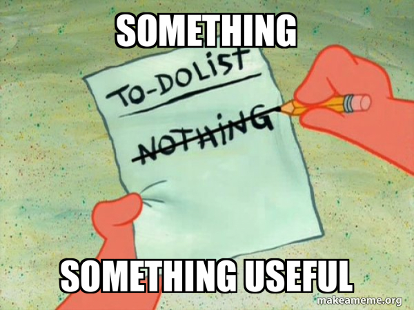

We'll hopefully start to build something a little more useful here....well, sort of.

But to get there we'll start to use `composite views` - a main view that uses other model with their own MVU implementation.

Here is where it starts to get fun, and also a lot more complicated.

We will be building a very basic TUI around opening a sqlite db and querying it. I have not done the work of breaking out all the components into isolated reuseable chunks, but this should give you the flavor of how you would go about something like this.